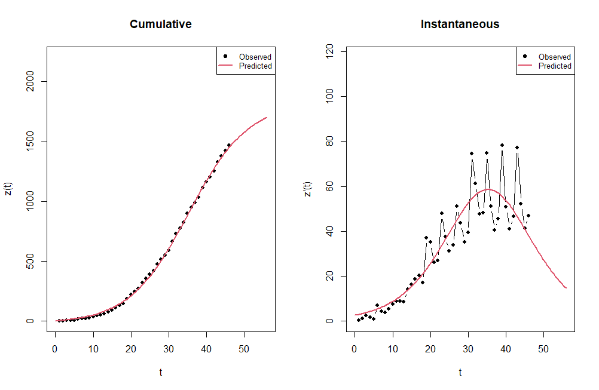

<!-- PROJECT SHIELDS -->
<!--
*** I'm using markdown "reference style" links for readability.
*** Reference links are enclosed in brackets [ ] instead of parentheses ( ).
*** See the bottom of this document for the declaration of the reference variables
*** for contributors-url, forks-url, etc. This is an optional, concise syntax you may use.
*** https://www.markdownguide.org/basic-syntax/#reference-style-links
-->


<p align="center">
  <a href="https://social-preview.pqt.dev">
    
  </a>
</p>


# DIMORA
R library for diffusion model analysis. `DIMORA` (**DI**ffusion **MO**dels **R** **A**nalysis) is a statistical package that allows the analysis of diffusion data using different models, among the most used and useful. The need for this package arises from the lack of a similar tool in R, the idea is therefore to provide a platform that allows the most in-depth analysis of the diffusion data.  ```Version 0.3.0```


[![Forks][forks-shield]][forks-url]
[![Stargazers][stars-shield]][stars-url]
[![Issues][issues-shield]][issues-url]
[![MIT License][license-shield]][license-url]
[![LinkedIn][linkedin-shield]][linkedin-url]

## Getting started

The implemented methods are: `Standard Bass model`, `Generalized Bass model` (with rectangular shock, exponential shock, and mixed shock. You can choose to add from 1 to 3 shocks), `Guseo-Guidolin model` and Variable Potential Market model, and `UCRCD model`. The Bass model consists of a simple differential equation that describes the process of how new products get adopted in a population, the Generalized Bass model is a generalization of the Bass model in which there is a "carrier" function x(t) that allows to change the speed of time sliding. In some real processes the reachable potential of the resource available in a temporal instant may appear to be not constant over time, because of this we use Variable Potential Market model, in which the Guseo-Guidolin has a particular specification for the market function. The UCRCD model (Unbalanced Competition and Regime Change Diachronic) is a diffusion model used to capture the dynamics of the competitive or collaborative transition.

## Prerequisites
```R
R (version >= 3.1.0)
```
Dependencies (automatically installed via install.packages)
```R
minpack.lm, numDeriv, stats, forecast, ggplot2, reshape2, deSolve
```

## Install
From Rstudio or Jupyter notebook
```R
install.packages('DIMORA') 
library(DIMORA)
```

Or cloning the Github repository to access files

```bash
$ git clone https://github.com/ZiliottoFilippoDev/DIMORA.git
$ cd R
```

## Usage
Bass model usage example

```R
data(DBdimora)
data <- DBdimora$iPhone[7:52]
model <- BM(data, display=T)
plot(model, type = 'all', oos = 20)
```



## License
Distributed under the `GPL-3.0` License. See `LICENSE.md` for more information.

## Contact
svandrea97@gmail.com

filippo.ziliotto1996@gmail.com

## References
Guidolin, M. (2023). Innovation Diffusion Models: Theory and Practice, First Edition. John Wiley & Sons Ltd.

[Documentation](https://www.rdocumentation.org/packages/DIMORA/versions/0.3.0)

[CRAN package](https://CRAN.R-project.org/package=DIMORA)


[contributors-shield]: https://img.shields.io/github/contributors/ZiliottoFilippoDev/DIMORA.svg?style=for-the-badge
[contributors-url]: https://github.com/ZiliottoFilippoDev/DIMORA/graphs/traffic
[forks-shield]: https://img.shields.io/github/forks/ZiliottoFilippoDev/DIMORA.svg?style=for-the-badge
[forks-url]: https://github.com/ZiliottoFilippoDev/DIMORA/network/members
[stars-shield]: https://img.shields.io/github/stars/ZiliottoFilippoDev/DIMORA.svg?style=for-the-badge
[stars-url]: https://github.com/ZiliottoFilippoDev/DIMORA/stargazers
[issues-shield]: https://img.shields.io/github/issues/ZiliottoFilippoDev/DIMORA.svg?style=for-the-badge
[issues-url]: https://github.com/ZiliottoFilippoDev/DIMORA/issues
[license-shield]: https://img.shields.io/github/license/ZiliottoFilippoDev/DIMORA.svg?style=for-the-badge
[license-url]: https://github.com/ZiliottoFilippoDev/DIMORA/blob/main/LICENSE.md
[linkedin-shield]: https://img.shields.io/badge/-LinkedIn-black.svg?style=for-the-badge&logo=linkedin&colorB=555
[linkedin-url]: https://www.linkedin.com/in/ziliottofilippodev/
